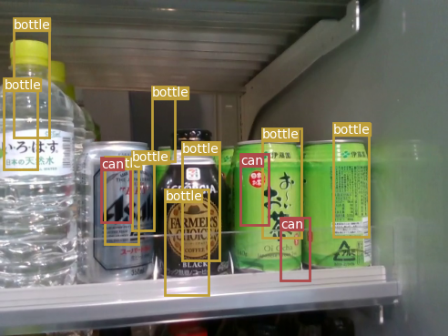
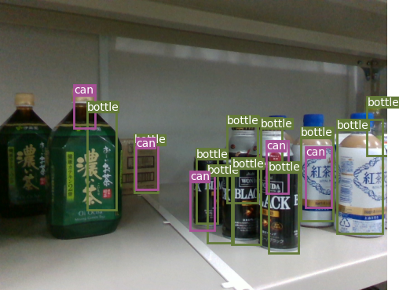
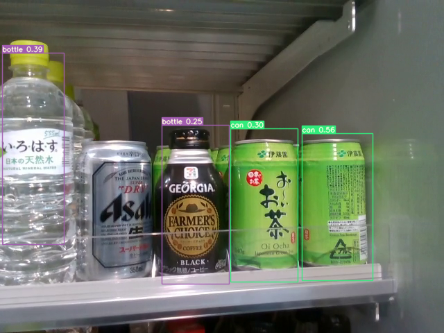
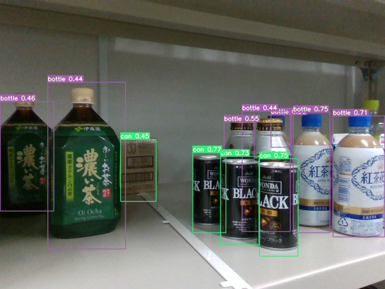

# Drink Object Detection Model
This object detection model is based on [YOLOv3](https://pjreddie.com/media/files/papers/YOLOv3.pdf).


## Table of Contents
- [Installation](#installation)
- [Inference](#inference)
- [Train](#train)
- [Test](#test)
- [Results](#results)
- [YOLOv7](#yolov7)
- [Future Work](#future-work)
- [Credits](#credits)

## Installation
#### Create the conda environment
    conda env create -f environment.yml

##### Download pretrained weights
- [Pre-trained Yolov3 Backbone](https://drive.google.com/file/d/1b0V5gb6qS561b8ou8LtJT6oeJ2TYatAu/view?usp=sharing)
- [Trained Yolov3](https://drive.google.com/file/d/11vv2ZCP_mgrxxZu57yDhryhxi1lEF70B/view?usp=sharing)

## Inference
The inference can be done in two ways. First, detect objects and create bounding boxes on images. Second is to just print the bounding boxes and class confidences only. It can be toggled by ```--detections_only```.

#### Create bounding boxes on images:
    python detect.py --batch_size 1 --weights_path checkpoints/wpretraining/yolov3_bb_trained.weights  --image_folder target_images/ --n_cpu 1 --class_path data/drinks/drinks.names

#### Just print bounding boxes and class confidence:
    python detect.py --batch_size 1 --weights_path checkpoints/wpretraining/yolov3_bb_trained.weights  --image_folder target_images/ --n_cpu 1 --class_path data/drinks/drinks.names --detections_only True

## Train
These are the options available for training the model. 
```
    train.py    [--epochs EPOCHS] [--image_folder IMAGE_FOLDER]
                [--batch_size BATCH_SIZE]
                [--model_config_path MODEL_CONFIG_PATH]
                [--data_config_path DATA_CONFIG_PATH]
                [--weights_path WEIGHTS_PATH] [--class_path CLASS_PATH]
                [--conf_thres CONF_THRES] [--nms_thres NMS_THRES]
                [--n_cpu N_CPU] [--img_size IMG_SIZE]
                [--checkpoint_interval CHECKPOINT_INTERVAL]
                [--checkpoint_dir CHECKPOINT_DIR]
                [--head_type] [--freeze_except]
```
For the hyperparameters applied in the actual training, the code snippets below are used. In case some hyperparameters are not written, the default values are used, which can be found in the ```train.py```

### Train with the YOLO Head:
This the default code for training with the YOLO head using the YOLOv3 backbone.

    python train.py --epochs 10 --batch_size 16 --model_config_path config/yolov3.cfg --data_config_path config/drinks.data --class_path data/drinks/drinks.names --head_type yolo

### Train with the Classification Head (ADDITIONAL):
Using the same backbone from Yolov3, it can be trained for image classification. The head is changed using the config file which becomes ```config/yolov3_ClsHead```. It can also be a good pretraining for the backbone weights. For this code, the dataset is CIFAR-10.

    python train.py --epochs 10 --batch_size 128 --model_config_path config/yolov3_ClsHead.cfg --data_config_path config/drinks.data --class_path data/drinks/drinks.names --head_type cls

### Train with Frozen Weights (ADDITIONAL):
The parameters of the model can be frozen. Starting from the last layer, adjust how many layers will be trained. The argument is ```--freeze_except``` which accepts an integer. The number will be the number of layers to be trained from the last layer.

    python train.py --epochs 10 --batch_size 16 --model_config_path config/yolov3.cfg --data_config_path config/drinks.data --class_path data/drinks/drinks.names --head_type yolo --freeze_except 3

## Test
This code computes the mAP of the model.

    python test.py --batch_size 16 --model_config_path config/yolov3.cfg --data_config_path config/drinks.data --class_path data/drinks/drinks.names --weights_path checkpoints/wpretraining/yolov3_bb_trained.weights

## Results
### Trained with this Object Detection Model (ODM):

<p align="center">
</p>

### Trained with YOLOv7 pretrained network:
<p align="center"></p>

### Notes on the results:
The Object Detection Model in this work is trained on a pretrained Yolov3 backbone. I was not able to train it for more epochs due to the limitations in GPU resources (Laptop GPU) and time. I could add more dataset to mimic the positioning of the target images but it would put more toll in the training so I did not pursue it. Furthermore, training a pretrained YOLOv7 backbone shows that the features of the can and bottle can be learned properly from the generated (synthetic) dataset. 

The shortcomings of the YOLOv3 backbone can be attributed to insufficient training, dataset, pretrained weights, and inherent capability of the architecture. Although YOLOv7 is a better choice, for the purposes of demonstrating a model with changeable heads, YOLOv3 backbone is used for its simplicity.

## YOLOv7
I added the YOLOv7 here to show that the generated synthetic dataset can teach a network to detect both bottles and cans. The model architecture, training techniques, and data augmentation improvements made it easier to create a better object detection model. To do image detection, download the weights [here](https://drive.google.com/file/d/1GoTw89pLlLZvKBYWBl56iKohd-26GB6D/view?usp=sharing) and run the code below. 

    python detect.py --weights runs/train/yolov7-custom/weights/yolov7_bb_trained.pt --conf 0.25 --img-size 640 --source [image_folder_location]

## Future Work
- [ ] Seeding

<!---
### Trained with this Object Detection Model (ODM):
### mAP from this ODM and YOLOv7 pretrained network
| Model                   | mAP (min. 50 IoU) |
| ----------------------- |:-----------------:|
| YOLOv3 backbone         |                   |
| YOLOv7 backbone         |                   |
-->


## Credits
```
@article{yolov3,
  title={YOLOv3: An Incremental Improvement},
  author={Redmon, Joseph and Farhadi, Ali},
  journal = {arXiv},
  year={2018}
}
```
```
@inproceedings{wang2023yolov7,
  title={{YOLOv7}: Trainable bag-of-freebies sets new state-of-the-art for real-time object detectors},
  author={Wang, Chien-Yao and Bochkovskiy, Alexey and Liao, Hong-Yuan Mark},
  booktitle={Proceedings of the IEEE/CVF Conference on Computer Vision and Pattern Recognition (CVPR)},
  year={2023}
}
```

Github code:  [Yolov3](https://github.com/eriklindernoren/PyTorch-YOLOv3), [Yolov7](https://github.com/WongKinYiu/yolov7/tree/main)


